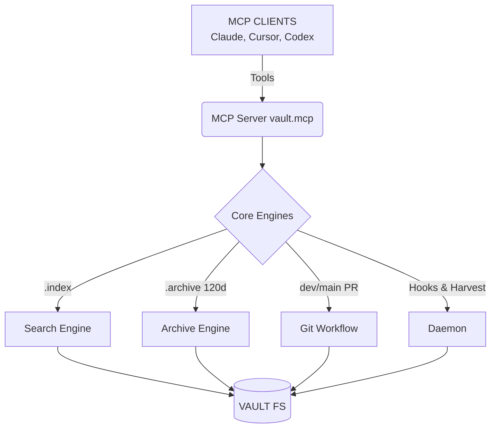

<div align="center">

[](https://github.com/pisigmac/AgentDrive/actions)
[](https://opensource.org/licenses/MIT)
[](https://www.python.org/downloads/)
[](https://github.com/psf/black)

<h1>
  <picture>
    
  </picture>
  <br/>
  AgentDrive
</h1>

<h3>Give your AI Agents a Git-Native, Infinite Memory Drive.</h3>

<p>
Say goodbye to black-box vector databases and locked-in memory platforms.<br/>
<b>AgentDrive</b> turns your local filesystem into a highly structured, self-updating,<br/>
markdown-based memory system for Claude, Cursor, and OpenAI.
</p>

</div>

---

### 🧠 The Next Evolution of Agent Context

└ **Git-Native Memory** — All agent writes go to `dev`, keeping `main` perfectly stable.<br>
└ **Central Brain Architecture** — Link endless repositories to a single, global memory vault.<br>
└ **Auto-Harvesting Daemon** — Background processes automatically summarize code changes into context.<br>
└ **Offline-First MCP Server** — Works locally without relying on cloud embeddings.<br>
└ **Built-in Auto-Archive** — Self-maintaining vault that archives stale contexts after 120 days.<br>
└ **Strict Governance** — Enforces root `AGENTS.md` rules for every autonomous action.<br>

<br>
<hr style="border: 0; height: 1px; background-image: linear-gradient(to right, rgba(0, 0, 0, 0), rgba(0, 0, 0, 0.25), rgba(0, 0, 0, 0));" />
<br>

### 🚀 Quick Start

One command to initialize AgentDrive globally:

```bash
curl -sSL https://raw.githubusercontent.com/pisigmac/agentdrive/main/setup.sh | bash
```

Or manually:

```bash
# 1. Install the CLI globally
git clone https://github.com/pisigmac/agentdrive.git
cd agentdrive
pip install -e .

# 2. Go to your own project and initialize a vault
cd ~/my-project
vault init
```

<br>
<hr style="border: 0; height: 1px; background-image: linear-gradient(to right, rgba(0, 0, 0, 0), rgba(0, 0, 0, 0.25), rgba(0, 0, 0, 0));" />
<br>

### 🌐 The Central Brain Architecture (Multi-Repo)

If you have multiple projects and don't want to clutter them with `.vault/` folders, you can use the Central Brain architecture.

1. **Create the Brain:** Pick a central folder (e.g., `~/AgentDriveBrain`) and run `vault init`.
2. **Activate the Brain:** Tell AgentDrive this is your primary brain by running `vault brain ~/AgentDriveBrain`.
3. **Link your Projects:** Navigate to any pure code repository and simply run `vault link`. It will automatically link to your active brain!

This drops a tiny `AGENTS.md` redirect file in your codebase that instructs AI agents to read context from the Central Brain. Every time you push or commit, the local daemon wakes up and routes all the generated context directly into your Brain repository!

<br>
<hr style="border: 0; height: 1px; background-image: linear-gradient(to right, rgba(0, 0, 0, 0), rgba(0, 0, 0, 0.25), rgba(0, 0, 0, 0));" />
<br>

### 📁 What You Get

A beautifully structured, self-governing memory filesystem out-of-the-box.

```text
vault/
├── AGENTS.md                 # Root governance (all providers read this)
├── projects/                 # Active work
├── people/                   # Contacts (never archived)
├── meetings/                 # Meeting notes
├── decisions/                # Architecture decisions
├── goals/                    # OKRs and objectives
├── resources/                # Bookmarks, articles
├── experiments/              # Ephemeral prototypes
├── threads/                  # Conversation histories
├── reviews/                  # Retrospectives
├── templates/                # Markdown templates
├── .vault/
│   ├── skills/               # Executable agent skills
│   ├── registry/             # Capability registry
│   ├── staging/              # Pending writes (dev branch)
│   ├── archive/              # Hidden — 120-day+ files
│   ├── index/                # Search indices
│   └── schemas/              # Validation schemas
└── .github/workflows/
    └── auto-archive.yml      # Weekly maintenance
```

<br>
<hr style="border: 0; height: 1px; background-image: linear-gradient(to right, rgba(0, 0, 0, 0), rgba(0, 0, 0, 0.25), rgba(0, 0, 0, 0));" />
<br>

### 🏗️ Architecture Flow

<div align="center">
  <code>User Prompt</code> → <code>Agent writes via MCP</code> → <code>Staged to 'dev' branch</code> → <code>Nightly PR raised</code> → <code>Human merges to 'main'</code>
</div>

<br>



<br>
<hr style="border: 0; height: 1px; background-image: linear-gradient(to right, rgba(0, 0, 0, 0), rgba(0, 0, 0, 0.25), rgba(0, 0, 0, 0));" />
<br>

### 🛠️ CLI Commands

```bash
# Initialize
vault init                       # Create new vault in current directory
vault init ~/my-vault            # Custom path

# Status & Health
vault status                     # Git + health overview
vault health --report            # Full diagnostic report

# Search
vault search "kubernetes"        # Keyword search
vault search "design" --semantic # Semantic rerank

# Archive
vault archive                    # Archive stale files
vault archive --dry-run          # Preview only

# Registry
vault registry --list            # All skills

# MCP
vault mcp --install              # Auto-configure Claude/Cursor
vault mcp --run                  # Start stdio server
```

<br>
<hr style="border: 0; height: 1px; background-image: linear-gradient(to right, rgba(0, 0, 0, 0), rgba(0, 0, 0, 0.25), rgba(0, 0, 0, 0));" />
<br>

### 📜 AGENTS.md Governance

Every vault has a root `AGENTS.md` that **ALL** AI providers must read before acting. It strictly defines:

1. **Branch Rule** — All writes go to `dev`, never `main`
2. **Approval Gate** — Stage to `.vault/staging/`, raise PR
3. **Schema Rule** — Every file needs frontmatter
4. **Archive Rule** — Old files move to `.vault/archive/`
5. **Source Tag** — Mark who wrote each file
6. **No Secrets** — Never store tokens in vault files
7. **Cross-Reference** — Use `[[WikiLinks]]` between entries

<br>
<hr style="border: 0; height: 1px; background-image: linear-gradient(to right, rgba(0, 0, 0, 0), rgba(0, 0, 0, 0.25), rgba(0, 0, 0, 0));" />
<br>

<div align="center">
  <p>Built for the autonomous future. Licensed under <b>MIT</b>.</p>
</div>
